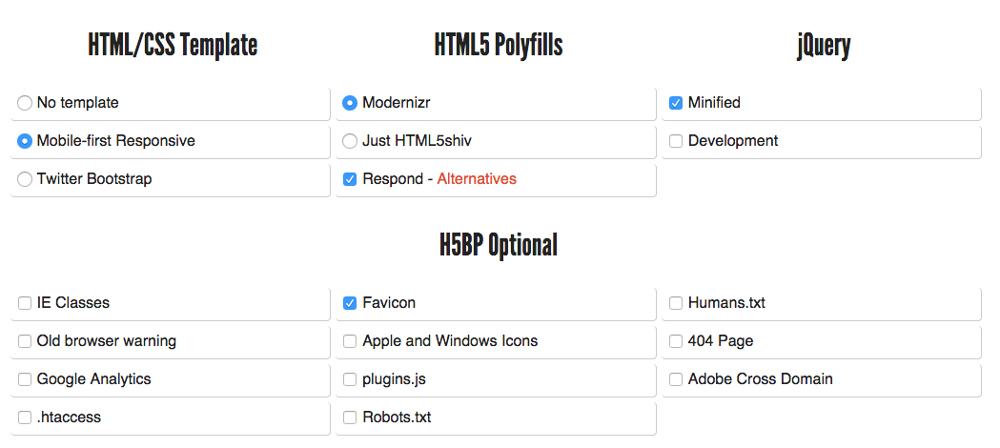

##Class Goal

We will discuss responsive design, and discover how using a boilerplate can help us to get a quick start with web projects.

##Lesson Plan

### MAMP / XAMPP / Local Server Checkup

Everyone should have a functioning local server.  Launch your local server.  Your document root should look something like this:


You may have some different files, but **all of your wordpress files should be in a wordpress folder**.


### Using Media Queries for Responsive Design

Media Queries are a feature in CSS that allow you to specify when a certain rule (or set of rules) will be applied.

```
// normal style
#header-image {
    background-repeat: no-repeat;
    background-image:url('image.gif');
}

// show a larger image when you're on a big screen
@media screen and (min-width: 1200px) {
    #header-image {
        background-image:url('large-image.gif');
    }
}

// remove header image when printing.
@media print {
    #header-image {
        display: none;
    }
}
```

Media queries start with `@media`, followed by a condition or set of conditions.  When the condition (or conditions) are true, the CSS inside of the media query will be triggered to apply.

The condition line ends with a {, and CSS rules are written (as usual) after the open curly brace.  Don't forget to close the curly brace!  You will end up with two closed curly braces } at the end of your media query - one for the last CSS rule, and one for the media query itself.

There are more conditions than I can list here, but if you are interested you can read more about the options on [Mozilla's guide to media queries](https://developer.mozilla.org/en-US/docs/Web/Guide/CSS/Media_queries) (Mozilla has a great CSS resource guide in general!).

The basic conditions you will see are:

#### Media Types

There are more than 10 media types, but the most commonly used ones are : 

```
screen (media type, generally refers to things viewed on a screen, including mobile devices)
print (media type, generally refers to printed documents.  This is how your page will look when printed!)
all (all of the media types combined - use this to apply to both screen and print!)
```

#### Measurements

Measurements allow you to get the width of the window (or the screen, if the window takes up the whole viewport, like on a phone).  Measurements can be done using any of the valid web measurements - most commonly pixels (px), but could be em or rem.

```
min-width
max-width
```

#### Logical Operators in Media Queries

Conditions in media queries can be combined using logical operators.  There are three different logical operators available for use within media queries, including `and`, `not`, and `only`.


### HTML5 Boilerplate

**HTML5 Boilerplate** is 'the web's most popular front-end template'.  Using HTML5BP to start web projects can give you a quick starting point and a base on which to build valid websites.

[HTML5 Boilerplate](https://html5boilerplate.com/)

You can download HTML5BP directly from this website, but I like to create a custom build using the [Initializr tool](http://www.initializr.com/) (linked from the main HTML5BP site).

Visit the [Initializr tool](http://www.initializr.com/), then choose the following settings (you can choose different ones for other projects or to experiment, but for right now use the settings I have selected).



You will want to unzip this into a **new folder** in your **document root**.  You can call this folder **boilerplate**.

### Coding Work

- Explore the HTML5 Boilerplate template you have downloaded
  
  - Change the color scheme
  - Change the text
  - Add a logo instead of the text
  - Add Google Web Fonts
  - Add Font Awesome social media icons

- Experiment with the provided media queries
  
  - can you change the header color when the browser is over 700px?

## Resources

[A really good tutorial on CSS and Responsive Web Design](http://learn.shayhowe.com/advanced-html-css/responsive-web-design/#media-queries)
[CSS Tricks - CSS Media Queries & Using Available Space](http://css-tricks.com/css-media-queries/)
[CSS Tricks - Media Queries for Standard Devices](http://css-tricks.com/snippets/css/media-queries-for-standard-devices/)
(http://alistapart.com/article/responsive-images-in-practice)

### Some Responsive Examples

[Marcotte's Example](http://alistapart.com/d/responsive-web-design/ex/ex-site-FINAL.html)
[Lots of examples at Mediaqueri.es](http://mediaqueri.es/)

### More about HTML5 Boilerplate

[Sitepoint's HTML5BP Introduction](http://www.sitepoint.com/introduction-html5-boilerplate/)
[HTML5BP in Simple Terms](http://ningbit.github.io/blog/2013/09/30/html5-boilerplate-explained-in-simple-terms/)