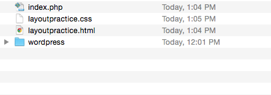

##Class Goal

We will discuss CSS layout using a grid, how to implement a pre-made grid system into your designs, and what CSS resets are for.

##Lesson Plan

### MAMP / XAMPP / Local Server Checkup

Everyone should have a functioning local server.  Launch your local server.  Your document root should look something like this:

### CSS Resets

Browsers like to apply their own basic styling to HTML elements.  For example, your browser will likely give your H1 tags a larger font size than your H2 tags.  UL list items will have bullets and be intended.

This can be desirable, and allows you to have a launching point when setting up your own styling.  However, one challenge is that elements are not always styled in the same way in different browsers.  Browsers have small inconsistencies when styling elements, and these inconsistencies can cause issues when viewing your pages in different browsers.

Web designers and developers will often utilize a **CSS Reset** to make browsers behave more consistently.  A CSS Reset is a small file that someone (or a group of people) has developed over time that will target browser inconsistencies and even them out, so that your CSS styles will look more similar on different browsers.

The CSS Reset I prefer to use is called [normalize.css](http://necolas.github.io/normalize.css/).  Normalize is nice because it does not strip away styling (some resets will strip all styling, for instance - making `strong` and `em` tags look like normal text).  To use Normalize, you will need to download it from the Normalize website, and then include the CSS file **before** any other stylesheets in your `header`.

** More Information **

- [What is a CSS Reset](http://www.cssreset.com/what-is-a-css-reset/)

### Grids and CSS

This lesson will introduce you to using a grid system for positioning content.  We have already done this in previous lessons - remember the activity we did in lesson 17 ([layout activity](/lessons/2014-10-03-advancedhtmlcss.html)) - using columns to lay out our content and creating sidebars and main content areas.

To design with a grid, you need to consider that your content can be broken up into rows and columns.  Every row can have any number of columns, but it looks nice if your columns are of predictable width.

** More Information **

- http://www.thegridsystem.org/
- http://jordanlev.github.io/grid/

### Grid Systems

There are probably over a hundred grid systems out there. Here are some that I have used and liked.

- [960 Grid System](http://960.gs/) (Note - this is NOT responsive)
- [Skeleton Grid](http://www.getskeleton.com/) (This is one of the simplest frameworks - and one of the first responsive grid systems I encountered!)
- [Base CSS]() (another framework, a bit more complicated to get set up but really simple code-wise)
- [Unsemantic Grid](http://unsemantic.com/) (The successor to 960 grid).
- [Gridism](http://cobyism.com/gridism/) (Very different, but simple!)
  
  
### Using Skeleton Grid

First, visit the [Skeleton Grid](http://getskeleton.com/) website.  Click the "Download" button.

Unzip the file you have downloaded into a **new folder** inside your document root.  Call this folder **skeleton**.

You should now be able to visit http://localhost/skeleton and view your page!

** Building a Landing Page **

Let's use the Skeleton example and build a landing page!

Go to the <a href="../media/0209/landing.zip">example code</a> (you can also get it from the Skeleton github repo, but I've pulled out just the files we want!).

**Use the files from this download to overwrite the things in your skeleton folder**.

You should now be able to visit http://localhost/skeleton and view your landing page!

Let's walk through the code and see what's happening.

### Free Coding Time

- Create a new file in your Skeleton folder.  
- Name it **layout.html**.  
- Include the skeleton grid and normalize (like in your landing page!)  
- Create a new CSS file and name it layout.css
- Include this CSS file in your layout file.
- Try to replicate <a href="../media/0202/layout3.png">this layout</a> using Skeleton's CSS.  Does having the grid system already built help you?
   
